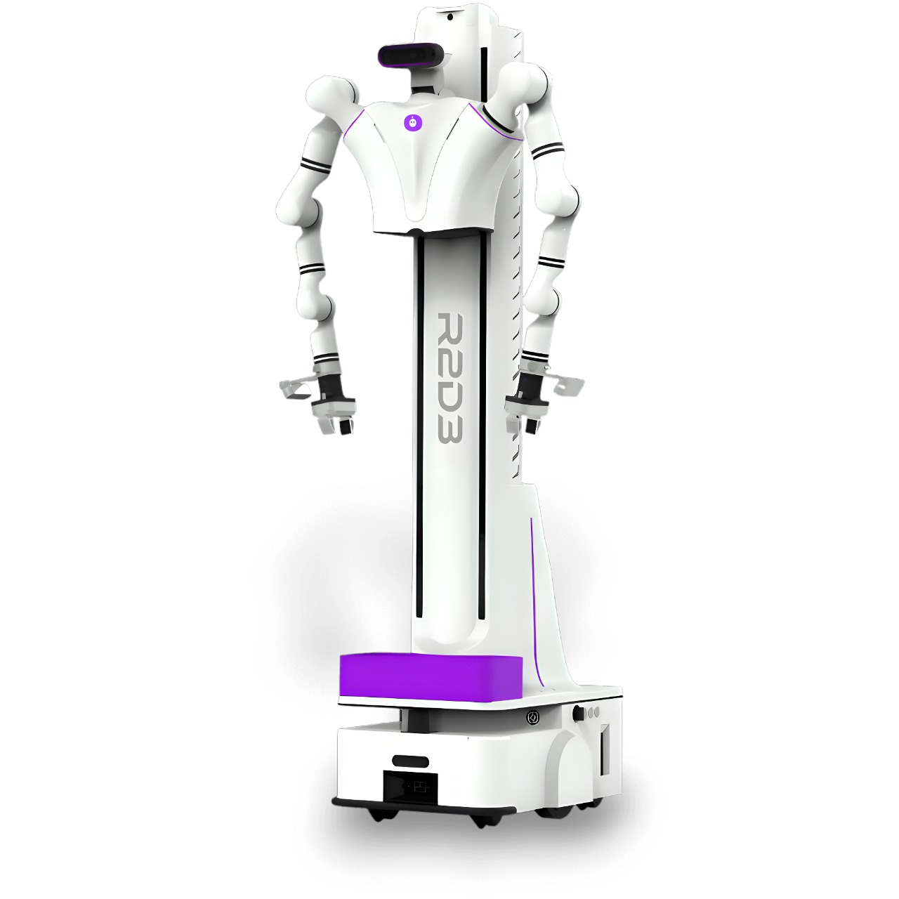

<div align="left">

[English](./README.md)

# Open Droids - R2D3



This package provides comprehensive ROS2 support for the **OpenDroids R2D3 dual-arm composite lifting robot** with multi-distribution support.

### 🎯 ROS2 Distribution Support

| Distribution | Ubuntu | Status | Recommended Use | Original R2D3 Support |
|--------------|--------|--------|-----------------|----------------------|
| **Foxy** | 20.04 | ✅ Supported | Original development, legacy systems | ✅ Native (Original target) |
| **Humble** | 22.04 | ✅ **Recommended** | Production use, best stability | ✅ Adapted |
| **Jazzy** | 24.04 | ✅ Supported | Latest features, cutting-edge | ✅ Adapted |

**Recommendation**: Use **Foxy or Humble** for the best balance of stability and features. The original R2D3 was designed for Foxy, and all packages have been adapted to work with newer distributions.

### 📋 Requirements

* The supported robotic arm controller version is 1.6.5 or above.
* Ubuntu 20.04+ (depending on ROS2 distribution)
* ROS2 Foxy, Humble, or Jazzy

| Embodied double-arm lifting robot (7-axis)                                        |                                                     |                                                              |
| ------------------------------------------------------------ | --------------------------------------------------- | ------------------------------------------------------------ |
| Part Name                                                     | Hardware version information                                        | Software version information                                                 |
| Mechanical arm                                                       | RM75-B                                              | Controller V1.6.5 and above, API V4.2.8 and above, ROS2 function package V1.0.1      |
| camera                                                         | Realsense D435C                                     | ros2_realsense2                                              |
| Main control                                                         | jetson xavier NX                                    | ubuntu20.04 、ros-foxy                                       |
| Chassis                                                         | woosh                                               | API version 0.10.8, socket communication                                    |
| Head motor/lift                                              | WHJ30-80 joint                                        | Used as the expansion axis of the robot arm, the head joint is connected to the right arm as the expansion joint, and the lift and lower joint is connected to the left arm as the expansion joint. |
| End Tool (optional)                                             | EG2-4C2 claws/Dexterous hand (right hand RM56DFX-2R/Left hand) RM56DFX-2L） | Integration with robotic arm API and ROS packages                                       |
| Voice module                                                     | Fun M240 microphone array                                 | Voice module information V5.1（https://pan.baidu.com/e/1nVS8SXqZWn5scmidNqWb7w?_at_=1724069216106） |
|  |                                                     |                                                              |

If the robot arm is RM65-B, set [ros2_rm_robot/dual_rm_driver/config/dual_left_config.yaml](./ros2_rm_robot/dual_rm_driver/config/dual_left_config.yaml) and [ros2_rm_robot/dual_rm_ driver/config/dual_right_config.yaml](./ros2_rm_robot/dual_rm_driver/config/dual_right_config.yaml) arm_type, arm_dof parameter 7 is changed to 6, and the arm_joints parameter joint7 is deleted.

For more information about the bot topic service function, see[List of services for the service of the embossed arms lifting ROS2](./List of services for the service of the embossed arms lifting ROS2.md)|

The following is the installation and use tutorial of the package.

## 🐳 Docker Implementation

This project provides a comprehensive containerized ROS2 development environment with **multi-distribution support** (Foxy, Humble, Jazzy) specifically configured for the **OpenDroids R2D3 dual-arm composite lifting robot**.

### 🚀 Quick Start

**Option 1: Docker Compose (Recommended)**
```bash
# One-command setup and start
make setup && make start

# Open shell in container
make shell

# Setup R2D3 packages
~/scripts/setup_r2d3.sh
```

**Option 2: Choose Your ROS2 Distribution**
```bash
# Original R2D3 (Foxy)
make start DISTRO=foxy

# Recommended for production (Humble) 
make start DISTRO=humble

# Latest features (Jazzy)
make start DISTRO=jazzy
```

### 🎯 Key Features

- **Multi-Distribution Support**: Foxy (original), Humble (recommended), Jazzy (latest)
- **Complete R2D3 Environment**: All robot packages pre-configured and ready
- **GUI Support**: Full X11 forwarding for RViz, Gazebo, and rqt tools
- **Audio Support**: PulseAudio integration for robot audio feedback
- **MoveIt2 Integration**: Motion planning and manipulation capabilities
- **Camera Support**: Intel RealSense D435 camera integration
- **Cross-Platform**: Works on Linux, macOS, and Windows (with WSL2)

### 📋 Prerequisites

```bash
# Install Docker and Docker Compose
sudo apt update && sudo apt install docker.io docker-compose-plugin

# Add user to docker group
sudo usermod -aG docker $USER
# Log out and back in for group changes to take effect
```

### 🛠️ Essential Commands

```bash
# Environment Management
make help              # Show all available commands
make setup             # Setup host environment (X11, PulseAudio)
make start              # Start default (Humble) environment
make start DISTRO=foxy  # Start specific distribution
make shell              # Open shell in running container
make stop               # Stop environment
make restart            # Restart environment
make status             # Check container status

# Development
make build              # Build images
make logs               # View container logs
make clean              # Clean up everything

# R2D3 Operations (inside container)
r2d3_camera            # Launch camera
r2d3_demo              # Launch robot demo
r2d3_build             # Build workspace
r2d3_ws                # Go to workspace
```

### 📚 Documentation

For comprehensive Docker documentation, see:
- **[Docker README](Docker/readme.md)** - Complete Docker setup guide
- **[Quick Start Guide](Docker/QUICKSTART.md)** - 5-minute setup tutorial
- **[Distribution Guide](Docker/DISTRO_GUIDE.md)** - ROS2 distribution details
- **[Workspace Overview](Docker/WORKSPACE_OVERVIEW.md)** - Project structure guide

---

## 1\. Build the environment
---
Before using the package, we first need to do the following operations.

* 1.[Install ROS2](#1.Install_ROS2) # skip if already installed 
* 2.[Install Moveit2](#Install_Moveit2)
* 3.[Configure the package environment](#Configure_the_package_environment)
* 4.[Compile](#Compile)

### 1.Install_ROS2

----

We provide the installation script for ROS2, `ros2_install.sh`, which is located in the `scripts` folder of the `ros2_rm_robot\dual_rm_install` package. In practice, we need to move to the path and execute the following commands.

```bash
sudo bash ros2_install.sh
```

If you do not want to use the script installation, you can also refer to the website [ROS2_INSTALL](https://docs.ros.org/en/foxy/Installation/Ubuntu-Install-Debians.html).

### Install_Moveit2

----

We provide the installation script for Moveit2, `moveit2_install.sh`, which is located in the `scripts` folder of the `ros2_rm_robot\dual_rm_install` package. In practice, we need to move to the path and execute the following commands.

```bash
sudo bash moveit2_install.sh
```

If you do not want to use the script installation, you can also refer to the website [Moveit2_INSTALL](https://moveit.ros.org/install-moveit2/binary/).

### Configure_the_package_environment

----

This script is located in the `lib` folder of the` ros2_rm_robot\dual_rm_driver` package. In practice, we need to move to the path and execute the following commands.

```bash
sudo bash lib_install.sh
```

----

Install chassis Ros2 interface installation package
Execute in the path of~/ros_2agv_robot/lib

link to lib : https://seafile.wsrobotics.com/d/9fee6b1fda3b4403919c/?p=%2F%E8%BD%AF%E4%BB%B6%E4%BA%8C%E6%AC%A1%E5%BC%80%E5%8F%91%E6%8E%A5%E5%8F%A3%2F%E5%BA%94%E7%94%A8%E5%B1%82ROS2%E6%8E%A5%E5%8F%A3%2Fv0.0.1&mode=list 

(if on Jetson)
```bash 
cd ros2_agv_robot/lib/
sudo ./ros-foxy-woosh-robot-agent_0.0.1-0focal_arm64.run
```
(if on other Arch(laptop or sim env))
```bash
cd ros2_agv_robot/lib/
sudo ./ros-foxy-woosh-robot-agent_0.0.1-0focal_amd64.run
```

### Compile

----

After the above execution is successful, execute the following commands to compile the package. First, we need to build a workspace and import the package file into the `src` folder under the workspace, and then use the `colcon build` command to compile.

```bash
mkdir -p ~/ros2_ws/src
cp -r rm_dual_arm_lifting_robot_ros2 ~/ros2_ws/src
cd ~/ros2_ws
colcon build --packages-select rm_ros_interfaces
colcon build --packages-select realsense2_camera_msgs
source ./install/setup.bash
colcon build
```


After the compilation is completed, the package can be run.

For more MoveIt configuration information, see[Embodied arms lifting ROS2-foxy-moveit2 configuration tutorial](./Dual-arm composite lifting ROS2-foxy-moveit2 configuration tutorial.pdf)|

## 2\. Function running

---

Introduction to the package: The package includes example control of the dual-arm composite lifting robot in ROS2, allowing users to perform ROS2 operations on the dual-arm composite lifting robot. For ease of portability, each part of the dual-arm composite lifting robot is separately split into independent packages, facilitating the reuse and assembly of the packages.

**Note:** The lifting module for the dual-arm lifting is connected to the lifting mechanism of the left arm, and the head rotation is connected to the expansion joint of the right arm.

### 2.1  Demos for Various Components

#### 2.1.1 AGV Demo

#### 2.1.2 Camera Demo

The camera demo is located in the ros2_realsense2 folder, and the realsense2_camera camera node needs to be started first during the demo package (rm_camera_demo) test, and the command is as follows:

```bash
source ~/ros2_ws/install/setup.bash
ros2 launch realsense2_camera rs_launch.py 
```

Note: The original camera node start command is ros2 launch realsense2_camera rs_launch.py, if you need to use depth alignment RGB images, you need to add parameters to get the aligned image topic.

To start the demo visualizing D435 images, use the following command.

```bash
ros2 run rm_camera_demo sub_image_node
```


Start the demo to get the coordinate value of the center point of the image, and run the following command:

```bash
ros2 run rm_camera_demo Center_Coordinate_node
```

If you want to view the point cloud information of the camera, you can use the demo example provided with the camera driver package with the following command.

```bash
source ~/ros2_ws/install/setup.bash
ros2 launch realsense2_camera demo_pointcloud_launch.py
```

open the first rgb camera
```bash
source ~/ros2_ws/install/setup.bash
ros2 run rm_camera_demo camera_0_node 
```

Open the second rgb camera
```bash
source ~/ros2_ws/install/setup.bash
ros2 run rm_camera_demo camera_1_node 
```

Open the realsense depth camera, and the program will detect all realsense cameras. You can open the specified camera by selecting the device number
```bash
source ~/ros2_ws/install/setup.bash
ros2 run rm_camera_demo open_realsense_node 
```

#### 2.1.3 Voice Module Demo

#### 2.1.4 Overall Linkage Demo

1. Test Demo

start driver

```
source ~/ros2_ws/install/setup.bash
ros2 launch ros2_total_demo total_demo.launch.py
```

start demo node

```
source ~/ros2_ws/install/setup.bash
ros2 run ros2_total_demo total_demo_node
```

2.camera catch Demo（obj bottle）

start driver

```
source ~/ros2_ws/install/setup.bash
ros2 launch ros2_total_demo start.launch.py
```

note：executing the camera node（ros2_total_demo/scripts detect_object.py）will print serial_number，please fill in the correct serial number in the code and compile it for execution

start the visual capture Program (Aoyi and smart hands)

```
source ~/ros2_ws/install/setup.bash
ros2 run ros2_total_demo catch2object_aoyi_hand.py
```

or

start the visual capture program（Two finger claws）

```
source ~/ros2_ws/install/setup.bash
ros2 run ros2_total_demo catch2object_gripper.py
```

Note: The test demo and visual grasping demo cannot be launched simultaneously. The execution script should be selected based on the end effector of the robot

### Safety Tips

----

Please refer to the following operation specifications when using the robotic arm to ensure the user's safety.

* Check the installation of the robotic arm before each use, including whether the mounting screw is loose and whether the robotic arm is vibrating or trembling.
* During the running of the robotic arm, no person shall be in the falling or working range of the robotic arm, nor shall any other object be placed in the robot arm's safety range.
* Place the robotic arm in a safe location when not in use to avoid it from falling down and damaging or injuring other objects during vibration.
* Disconnect the robotic arm from the power supply in time when not in use.

### 🐛 Docker Troubleshooting

**Container won't start:**
```bash
# Check Docker is running
sudo systemctl start docker

# Check permissions
groups $USER  # Should include 'docker'
```

**GUI applications don't show:**
```bash
# Setup X11 forwarding
make setup
# Or manually:
xhost +local:docker
```

**Audio doesn't work:**
```bash
# Start PulseAudio
pulseaudio --start

# Check audio devices in container
aplay -l
```

**Build failures:**
```bash
# Clean and rebuild
make clean
make build
```

### Version update

| Revision | Content Update | Effective Date |
| ---------------------------------------------------------------------------------------------------------------------------------------------------------------------------------------------------------------------------------------------------------------
| V1.0 | First Submit Code | 2024-11-11 |
| V1.1 | 1. Modified driver cannot report UDP information BUG 2. Added robotic arm gazebo simulation function | 2024-11-25 |
| V1.1.1 | 1. Improved the overall linkage demo 2. Modified the left-hand installation direction bug in urdf 3. Optimized the camera code | 2024-12-12 |
| V1.1.2 | 1. Added visual crawling demo | 2024-12-24 |
| V1.1.3 | 1. Added chassis function package when enlightenment | 2025-01-02 |
| V1.2.0 | 1. **Major Docker Update**: Multi-distribution support (Foxy, Humble, Jazzy) 2. Comprehensive Docker Compose setup 3. Enhanced development environment with GUI and audio support 4. Updated documentation and quick start guides | 2025-01-15 |

### Common problem
1. exec:sudo bash ros2_install.sh
error：invalid option line 7: set: -
solution： dos2unix ros2_install.sh
